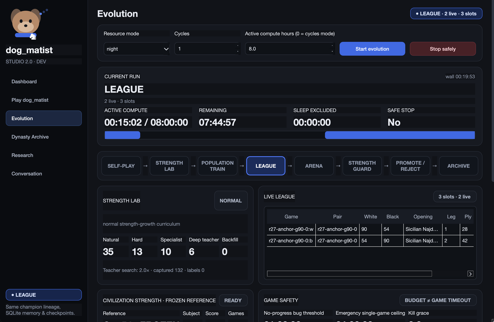
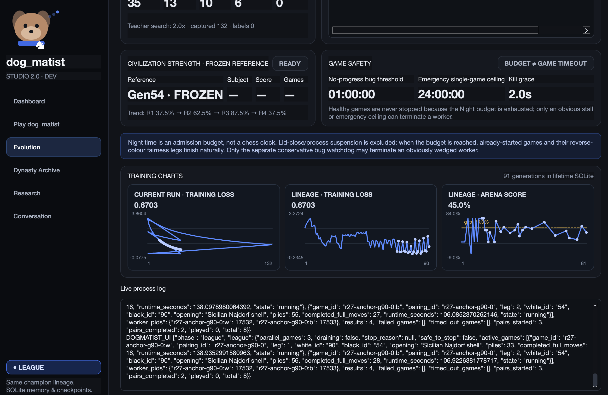
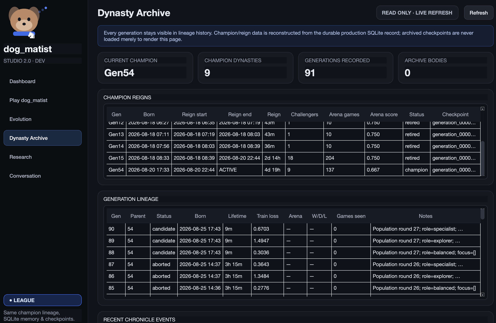
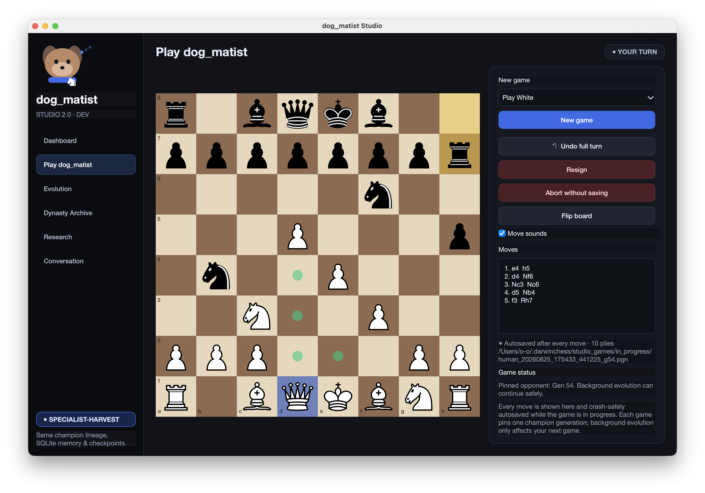
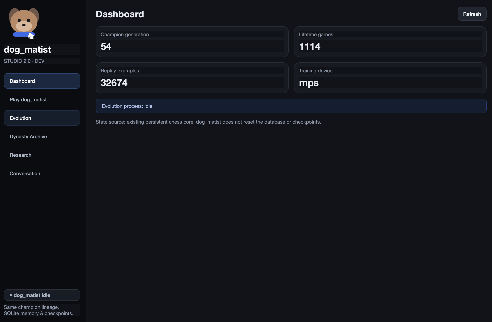

# dog_matist

**A persistent self-play chess system for studying continual improvement under limited local compute.**

`dog_matist` is an experimental chess agent that keeps learning across runs instead of restarting from scratch. It generates self-play experience, trains multiple candidate generations, evaluates them through league and Arena stages, and promotes a new champion only when it passes the selection gate.

Its learned state, replay experience, champion lineage, evaluation history, and metrics persist over time. The project is designed to explore how far a small game-playing system can continue improving on ordinary consumer hardware.

> **Status:** active personal research project / experimental prototype.



## Why I built this

I originally started with a simple question:

**Can a chess agent keep improving over time on my MacBook, rather than being trained once and then frozen?**

That quickly led to harder questions:

- How do you distinguish real improvement from evaluation noise?
- How do you stop a lucky challenger from replacing a stronger champion?
- How do you preserve useful specialists that are not the overall best model?
- How do you keep self-play diverse enough to avoid repeatedly learning the same openings?
- How should replay experience and model history persist across many training cycles?
- How much continual improvement is possible under a fixed local compute budget?

I am not treating `dog_matist` as a finished research result. I built it as a working system to learn from these problems and to understand how self-play, search, selection, and continual learning interact in practice.

---

## Core loop

```text
CURRENT CHAMPION
      │
      ▼
   SELF-PLAY
      │
      ▼
PERSISTENT REPLAY
      │
      ▼
POPULATION TRAINING
      │
      ▼
     LEAGUE
      │
      ▼
     ARENA
      │
      ▼
STRENGTH / SAFETY GUARDS
      │
      ▼
 PROMOTE / REJECT
      │
      ▼
ARCHIVE + LINEAGE
      │
      └──────────────► repeat
```

Training alone never replaces the champion. Candidate generations must survive evaluation before promotion, while useful historical information remains available for later analysis.



---

## Main ideas

### Persistent learning

Training state survives between sessions. The system retains champion checkpoints, replay experience, metrics, evaluation history, and lineage rather than treating each run as an isolated experiment.

### Population and league-style evaluation

Instead of relying on a single challenger at a time, the current system can train and evaluate multiple candidate roles within a population/league workflow.

Candidates can occupy different roles or focuses, and league play provides an intermediate selection layer before the final Arena gate.

### Champion–challenger selection

A candidate does not become champion simply because it finished training.

Promotion is separated from learning so that a newly updated model must demonstrate strength under held-out evaluation before replacing the current champion.

### Opening diversity

Self-play uses a mixture of standard starts, curated sound positions, less-common legal positions, and controlled exploratory continuations.

These positions act as starting seeds rather than a fixed opening book: after the starting position is chosen, `dog_matist` calculates its own moves.

### Hybrid chess engine

The engine combines learned and classical components, including:

- residual CNN policy/value network
- iterative-deepening alpha-beta search
- quiescence search
- neural + classical evaluation
- continual AdamW training
- durable replay memory
- self-play generation

The goal is not to reproduce a large-scale engine such as AlphaZero. The focus is on persistent learning and selection under much tighter compute constraints.

### Persistent lineage and dynasty history

Every generation is recorded so that the system can reconstruct long-term model history rather than treating previous generations as disposable artifacts.

The archive tracks champion reigns, candidate generations, lineage, training loss, Arena results, and other historical events.



This makes it possible to inspect questions such as:

- how long a champion survives
- how many challengers it defeats
- whether later generations actually become stronger
- when progress stalls
- whether specialists are being created but failing to become overall champions

---

## dog_matist Studio

The project includes a desktop interface for observing and interacting with the system while it runs.

The Studio exposes:

- live Evolution stages
- population / league activity
- training and Arena metrics
- champion and lineage history
- resource and safety controls
- graphical human play
- runtime status and logs

### Human play

Human play can run alongside background evolution. A game pins the champion that existed when the game began, so a promotion in the background does not silently change the opponent halfway through the game.



### Dashboard

The dashboard provides a compact view of the persistent system state, including the current champion, lifetime games, replay examples, training device, and runtime status.



---

## Repository structure

```text
darwinchess/    core chess, search, self-play, training and evaluation
dogmatist_v2/   evolution, population, league, lineage and strength systems
studio/         graphical desktop interface
configs/        runtime configuration
tests/          automated tests
docs/           architecture, validation and development notes
```

The internal `darwinchess` package name is retained for backwards compatibility with an earlier prototype of the project.

---

## Running the project

### Requirements

The current setup is primarily developed and tested on **macOS** with **Python 3.11+**.

Clone the repository:

```bash
git clone https://github.com/YOUR_USERNAME/dog_matist.git
cd dog_matist
```

Run the setup script:

```bash
chmod +x setup_mac.sh
./setup_mac.sh
```

Launch the graphical Studio:

```bash
./run_studio.command
```

Run one normal Evolution cycle:

```bash
./run_normal.command 1
```

Run an overnight session:

```bash
./run_night.command 8
```

The night launcher uses macOS `caffeinate` so the machine can remain awake during longer experiments.

---

## CLI

The project also exposes a command-line interface:

```bash
dog-matist status
dog-matist doctor
dog-matist selfplay --games 10
dog-matist --mode normal evolve --cycles 1
dog-matist --mode night evolve --hours 8
dog-matist challenge --steps 120 --games 10
dog-matist play --color white
dog-matist chat
dog-matist export
```

---

## Questions I am exploring

`dog_matist` does **not** assume that a finite neural architecture can improve indefinitely.

The more useful question is whether persistent replay, continual parameter updates, diverse self-play, population-based training, and held-out selection can keep producing measurable gains for a meaningful amount of time under a fixed local compute budget.

Some of the questions I am currently interested in are:

1. **Evaluation reliability**  
   How many games and how much position diversity are needed before a champion–challenger result is trustworthy?

2. **Long-term stagnation**  
   When one champion survives many generations, is the system converging, under-exploring, or evaluating too conservatively?

3. **Specialist preservation**  
   How can useful models that are strong in specific openings or positions be preserved without keeping every historical model active?

4. **Opening generalization**  
   Does increasing opening diversity produce genuinely stronger agents or simply redistribute performance across positions?

5. **Population diversity**  
   Can multiple candidate roles help avoid repeatedly producing near-identical challengers?

6. **Compute efficiency**  
   Which parts of self-play, search, training, and evaluation provide the most improvement per unit of local compute?

7. **Continual improvement**  
   Under what conditions does repeated self-play and selection produce stronger generations rather than oscillation or regression?

---

## Current limitations

`dog_matist` is an experimental system, not a claim of state-of-the-art chess strength.

Current limitations include:

- training is constrained to consumer hardware
- evaluation still depends on a finite number of games
- stronger search improves evaluation quality but increases runtime substantially
- self-play distributions can still become biased
- population diversity does not guarantee useful strategic diversity
- continual training does not guarantee indefinite improvement
- several specialist-preservation and long-term selection mechanisms are still under active development

These limitations are part of the reason I am interested in studying the system more seriously.

---

## Documentation

Additional implementation and development notes are available under [`docs/`](docs/), including architecture, validation, experiments, migration notes, and the original technical README.

---

## Project status

`dog_matist` is actively evolving.

The current focus is:

**evaluation reliability → opening diversity → population/league training → long-term lineage tracking → specialist preservation → resource-efficient continual self-play**

My broader goal is to use the project as a way to learn how to study game-playing and continual-learning systems more rigorously, and to identify which parts of the current design are worth investigating further.

---

## License

See [`LICENSE`](LICENSE).
